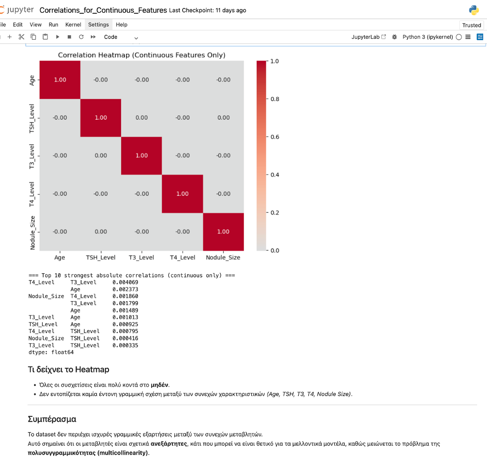
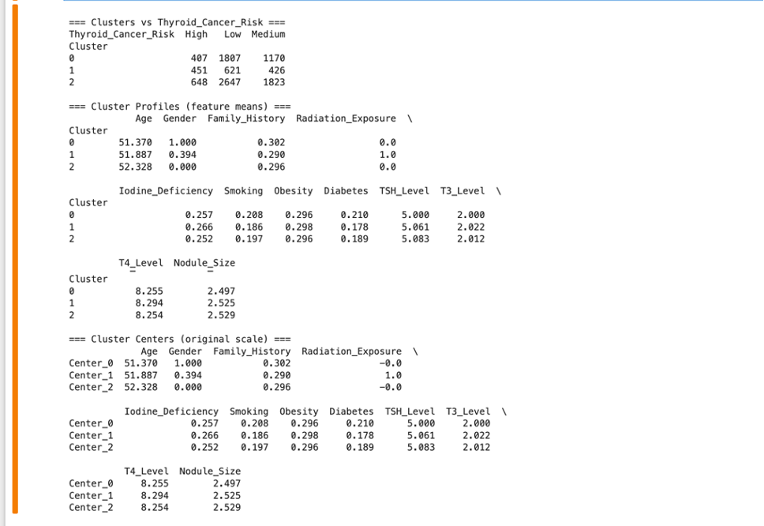
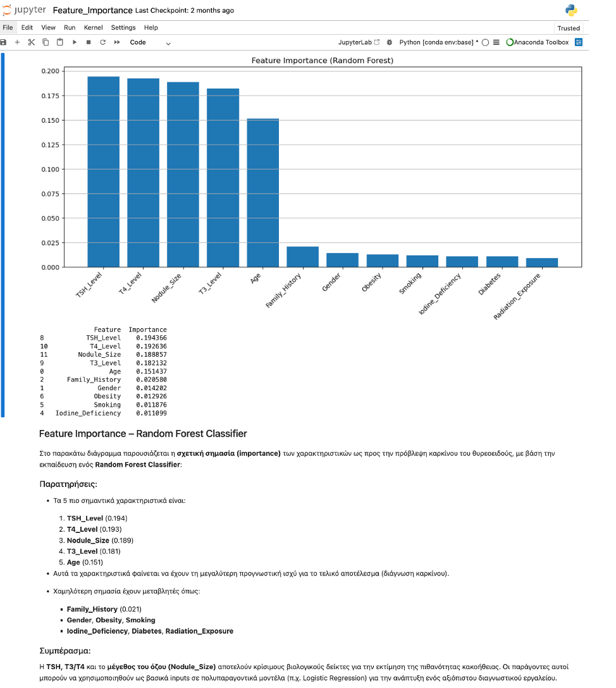

# thyroid-cancer-risk-ml
Thyroid Cancer Risk Analysis using Machine Learning: Classification, Clustering , Feature Correlations

This project develops a machine learning pipeline to assess thyroid cancer risk, identify critical predictive features, and support clinical decision-making through data-driven insights.

### 📌 Overview

This project aims to predict thyroid cancer risk using Machine Learning techniques applied to a real-world medical dataset.
It was developed as part of my MSc in Business Information Systems and demonstrates full-cycle data analytics, from data preprocessing and feature evaluation to model training, cross-validation, and GUI visualization.

The result is an interpretable, reproducible, and interactive analytical environment built entirely in Python, integrating both statistical rigor and visual clarity for clinical decision support.

### 🧠 Project Objectives

Develop explainable ML models for early detection of thyroid malignancy.

Identify key demographic, genetic, environmental, and biochemical predictors.

Ensure methodological reliability via robust cross-validation and balanced sampling.

Deliver a Graphical User Interface (GUI) for dynamic result exploration.

### 📊 Dataset

212,691 patient records

17 clinical & demographic features

Class imbalance present → addressed via subsampling

### 🧬 Feature Categories

Source: Kaggle — Thyroid Cancer Risk Dataset (Chirumamilla, 2023)

| Feature Category                    | Features                                                               |
| ----------------------------------- | ---------------------------------------------------------------------- |
| Identifier                          | Patient_ID                                                             |
| Demographics                        | Gender, Age, Country, Ethnicity                                        |
| Genetic Factor                      | Family_History                                                         |
| Environmental & Metabolic Factors   | Radiation_Exposure, Iodine_Deficiency, Smoking, Obesity, Diabetes      |
| Endocrinological / Clinical Markers | TSH_Level, T3_Level, T4_Level, Nodule_Size                             |
| Pre-risk Assessment                 | Thyroid_Cancer_Risk *(excluded from training — to avoid data leakage)* |
| **Target Variable**                 | **Diagnosis** (Benign vs Malignant)                                    |

📌 Total Features Used in Modeling: 16 predictors + 1 target = 17 attributes

### 🛠️ ML Workflow & Methodology
1️⃣ Data Validation & Preprocessing

Ensured medical-grade data quality
(feature relevance screening, no missing/duplicate records, outlier validation on endocrine markers)

Encoded categorical values & standardized continuous features for supervised learning algorithms
 

2️⃣ 🔍 Correlation Analysis for Continuous Clinical Features

(TSH_Level, T3_Level, T4_Level, Nodule_Size, Age)

Pearson Correlation Matrix → Heatmap Visualization

Result: Low correlation strength (|r| < 0.7)

➡️ Minimal multicollinearity → all predictors retained

 

3️⃣ 🧬 Unsupervised Learning — K-Means Clustering

Explored natural grouping without using Diagnosis & 

Weak clustering structure

➡️ Confirms need for supervised ML for diagnostic prediction

| Step | Technique | Why You Used It | Field Impact |
|------|-----------|----------------|--------------|
| Normalization | StandardScaler (Mean=0, Std=1) | Ensures equal contribution of differently scaled features; improves comparisons across LR & RF | Better gradient behavior & fairer clinical indicator influence |
| Train/Test Split | 75% Train / 25% Test | Aligns with 4-Fold CV distribution (~25% per fold); maintains unseen test set | Fair generalization estimate for real-world deployment |
| Cross-Validation | Stratified 4-Fold CV — Repeated 100x | Preserves Diagnosis ratio in all folds; reduces variance from class imbalance | Clinically stable & reproducible model evaluation |
| Class Imbalance Solution | Repeated balanced subsampling (50 malignant / 50 benign each repetition) | Prevents model bias toward majority benign cases | Equitable cancer-risk assessment; higher trust in malignant predictions |

📌 Models evaluated 100 times with a 75% train - 25% test → Final scores = Median Accuracy + Median AUC

4️⃣ Feature Importance

Algorithms used:

Logistic Regression → interpretable risk contribution

Random Forest → nonlinear feature interactions

SHAP values validated LR’s findings.

Top 3 Stable Prognostic Factors:
1️⃣ Family_History
2️⃣ Iodine_Deficiency
3️⃣ Radiation_Exposure

Consistent with biological expectations ✔

✔ 5️⃣ Triad-Based Performance Evaluation

Instead of evaluating single attributes alone ⟶
Created all possible combinations of 3-feature models ("Triads")

Why?
🧠 Cancer risk is multifactorial → interactions matter more

Evaluated using:

Sub-sampling balanced training (100 iterations)

Stratified 4-Fold Cross-Validation

Median Accuracy & AUC

Results Summary
| Model               | Best Median Accuracy | Best Median AUC | Stability |
| ------------------- | -------------------- | --------------- | --------- |
| Logistic Regression | ~0.59                | ~0.61           | Higher    |
| Random Forest       | ~0.51                | ~0.52           | Lower     |

### 🎛 GUI Deployment

A prediction interface built using Tkinter:

-Demonstrates practical usability & accessibility
-A complete visualization environment was created for clinicians/researchers:

✔ Full-screen interface
✔ Scrollable plots (PIL + Canvas)
✔ Dynamic Zoom
✔ 5 modules:

Correlation Heatmap

K-Means Clustering

Top-5 LR Triads

Top-5 RF Triads

Final Conclusive Outcomes

Purpose: Turn clinical data into interactive risk intelligence.

### 🧪 Tools & Technologies
| Category        | Tech                        |
| --------------- | --------------------------- |
| Languages       | Python                      |
| ML Libraries    | Scikit-learn,          |
| Visualization   | Matplotlib, Seaborn   |
| GUI Development | Tkinter, PIL                |
| Environment     | Jupyter Notebook (Anaconda) |

### 🏁 Key Outcomes

📍 Identified three highly stable prognostic factors
📍 Logistic Regression proved most clinically reliable
📍 Demonstrated feasible ML-based support for thyroid-cancer diagnosis
📍 Delivered a functional GUI for real-time analysis

## Key Visualizations

### Correlation Heatmap
This heatmap checks for linear relationships between continuous features (Age, TSH, T3, T4, Nodule_Size) and verifies there is no strong multicollinearity.

---

### K-Means Clusters (PCA Projection)
Unsupervised clustering (K-Means, k=3) on the clinical features, projected in 2D using PCA, to see whether patients naturally form low/medium/high risk groups.

(visuals/kmeans_clusters_pca2.png)

---

### Feature Importance – Random Forest
Random Forest feature importances highlighting the most predictive clinical markers for thyroid cancer risk.

---

### Feature Importance – Logistic Regression (L1)
L1-regularised Logistic Regression used as a sparse, more interpretable model to confirm which features remain important.

---

### SHAP Values – Logistic Regression Explainability
SHAP values used to explain individual predictions and the global impact of each feature on the model output.

---
### 🚀 Future Enhancements

✔ Integrate XGBoost + LightGBM
✔ Hyperparameter tuning & feature engineering
✔ Testing with newer clinical datasets for medical validation
✔ Add prediction mode in GUI for clinical trial use

👩‍⚕️ Author

Vasileia Damaskou Sutton
Junior Data Analyst | Healthcare Analytics
Python · SQL · Power BI · Tableau · Machine Learning · Weka

✳️ This project is part of my MSc Business Information Systems thesis work.✔ Deployable interface → demonstrates practical utility
